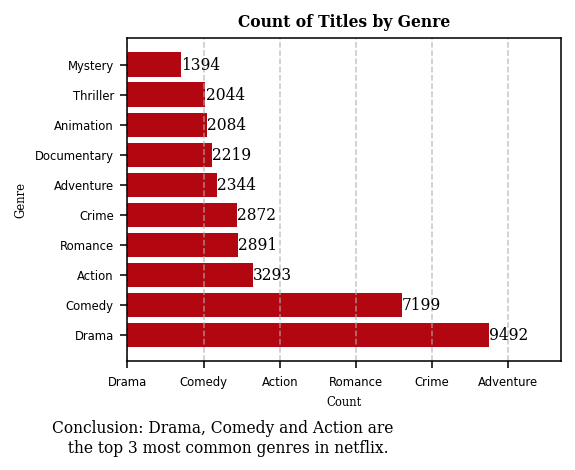
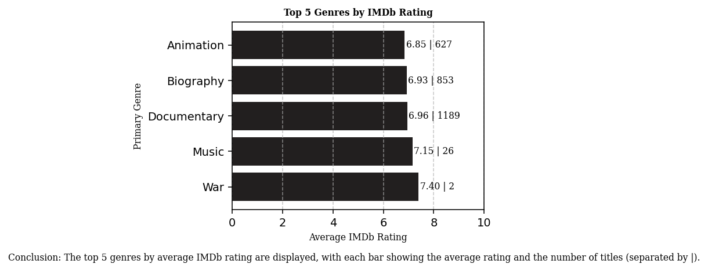
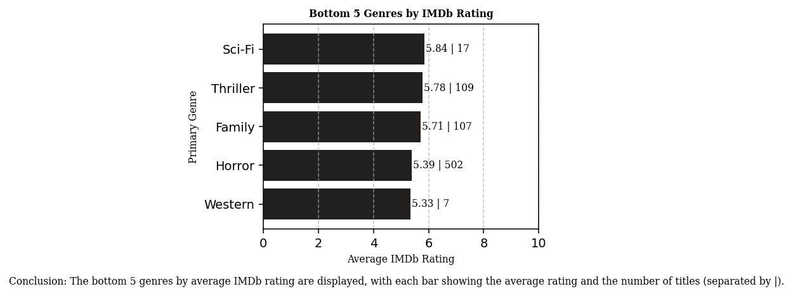
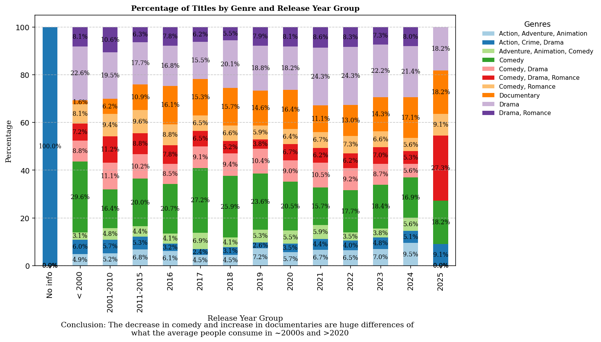
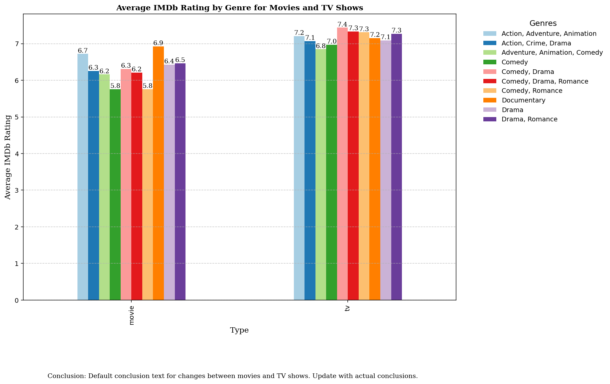

Disclaimer: Keep in mid that a jupyter notebook is a finished job, 
the thinking and needed adaptions were removed as the projects grows


```python
# Imports 
import warnings
warnings.filterwarnings("ignore")
import pandas as pd
import numpy as np
from sklearn.preprocessing import StandardScaler
from sklearn.cluster import KMeans, AffinityPropagation
import matplotlib.pyplot as plt
import seaborn as sns
import plotly as py
import plotly.graph_objs as go
import os
import datetime as dt
plt.rcParams['figure.dpi'] = 140
%matplotlib inline
```


```python
df = pd.read_csv('netflix_titles.csv') #Netflix Dataset
df.head() # Shows 5 first rows on the dataframe
```


<div>
<style scoped>
    .dataframe tbody tr th:only-of-type {
        vertical-align: middle;
    }

    .dataframe tbody tr th {
        vertical-align: top;
    }

    .dataframe thead th {
        text-align: right;
    }
</style>
<table border="1" class="dataframe">
  <thead>
    <tr style="text-align: right;">
      <th></th>
      <th>title</th>
      <th>type</th>
      <th>genres</th>
      <th>releaseYear</th>
      <th>imdbId</th>
      <th>imdbAverageRating</th>
      <th>imdbNumVotes</th>
      <th>availableCountries</th>
    </tr>
  </thead>
  <tbody>
    <tr>
      <th>0</th>
      <td>The Fifth Element</td>
      <td>movie</td>
      <td>Action, Adventure, Sci-Fi</td>
      <td>1997.0</td>
      <td>tt0119116</td>
      <td>7.6</td>
      <td>520476.0</td>
      <td>AT, CH, DE</td>
    </tr>
    <tr>
      <th>1</th>
      <td>Kill Bill: Vol. 1</td>
      <td>movie</td>
      <td>Action, Crime, Thriller</td>
      <td>2003.0</td>
      <td>tt0266697</td>
      <td>8.2</td>
      <td>1232113.0</td>
      <td>AE, AL, AO, AT, AU, AZ, BG, BH, BY, CI, CM, CZ...</td>
    </tr>
    <tr>
      <th>2</th>
      <td>Jarhead</td>
      <td>movie</td>
      <td>Biography, Drama, War</td>
      <td>2005.0</td>
      <td>tt0418763</td>
      <td>7.0</td>
      <td>213209.0</td>
      <td>AD, AE, AG, AO, BH, BM, BS, BZ, CI, CM, CO, CR...</td>
    </tr>
    <tr>
      <th>3</th>
      <td>Unforgiven</td>
      <td>movie</td>
      <td>Drama, Western</td>
      <td>1992.0</td>
      <td>tt0105695</td>
      <td>8.2</td>
      <td>447667.0</td>
      <td>AU, BA, BG, CZ, HR, HU, MD, ME, MK, NZ, PL, RO...</td>
    </tr>
    <tr>
      <th>4</th>
      <td>Eternal Sunshine of the Spotless Mind</td>
      <td>movie</td>
      <td>Drama, Romance, Sci-Fi</td>
      <td>2004.0</td>
      <td>tt0338013</td>
      <td>8.3</td>
      <td>1117918.0</td>
      <td>AD, AE, AG, AL, AO, AR, AU, AZ, BA, BB, BE, BG...</td>
    </tr>
  </tbody>
</table>
</div>


The dataset is pretty much the content you can see on the default page in netflix, let's see what the informations show to us.


```python
# Analysis 
for col in df.columns:
    null_rate = 100*df[col].isna().sum() / df.shape[0]
    if null_rate > 0 :
        print("{} null rate: {}%".format(col,round(null_rate,2)))
```

    title null rate: 2.97%
    genres null rate: 1.6%
    releaseYear null rate: 0.16%
    imdbId null rate: 7.18%
    imdbAverageRating null rate: 8.07%
    imdbNumVotes null rate: 8.07%
    

# Netflix pallete 
Consistency in color scheme across all visual materials helps reinforce brand identity. When your audience sees familiar colors, they immediately associate the visuals with your brand, creating a sense of trust and recognition.


```python
sns.palplot(['#221f1f', '#b20710', '#e50914','#f5f5f1'])
plt.title("Netflix brand palette ",loc='left',fontfamily='serif',fontsize=15,y=1.2)
plt.show()
```


    

    


```python
# Define custom function to group years
def group_years(year):
    if pd.isna(year):
        return 'No info'
    if year < 2000:
        return '< 2000'
    elif 2000 <= year <= 2010:
        return '2001-2010'
    elif 2011 <= year <= 2015:
        return '2011-2015'
    else:
        return str(int(year))
    
df['releaseYearGroup'] = df['releaseYear'].apply(group_years)


# Define the desired order for the x-axis
year_order = ['No info','< 2000', '2001-2010', '2011-2015'] + \
sorted(df[df['releaseYear'] >= 2016]['releaseYear'].astype(int).astype(str).unique().tolist())


from pandas.api.types import CategoricalDtype
cat_type = CategoricalDtype(categories=year_order, ordered=True) 
df['releaseYearGroup'] = df['releaseYearGroup'].astype(cat_type)


counts = df.groupby(['releaseYearGroup', 'type']).size().unstack().fillna(0)

# Calculate the percentage of each type per year
percentages = counts.div(counts.sum(axis=1), axis=0) * 100

# Create subplots for vertical comparison
fig, axes = plt.subplots(2, 1, figsize=(10, 12))

# Plot the stacked bar chart for percentages
colors = ['#221f1f', '#b20710']
percentages.plot(kind='bar', stacked=True, color=colors, ax=axes[0])

# Add percentages on the bars
for i in axes[0].containers:
    axes[0].bar_label(i, label_type='center', fmt='%.0f%%', fontsize=10, fontweight='light', fontfamily='serif', color='white')

# Set title and labels for the percentage chart
axes[0].set_title('Cumulative Distribution of Movies and TV Shows by Year', fontsize=15, fontweight='bold', fontfamily='serif')
axes[0].set_xlabel('Year Added', fontsize=12, fontfamily='serif')
axes[0].set_ylabel('Proportion (%)', fontsize=12, fontfamily='serif')
axes[0].legend(title='Type', fontsize=10, title_fontsize=12)
axes[0].grid(axis='y', linestyle='--', alpha=0.7)

# Plot the stacked bar chart for absolute counts
counts.plot(kind='bar', stacked=True, color=colors, ax=axes[1])

# Add counts on the bars
for i in axes[1].containers:
    axes[1].bar_label(i, label_type='center', fmt='%d', fontsize=10, fontweight='light', fontfamily='serif', color='white')

# Set title and labels for the count chart
axes[1].set_title('Total Count of Movies and TV Shows by Year', fontsize=15, fontweight='bold', fontfamily='serif')
axes[1].set_xlabel('Year Added', fontsize=12, fontfamily='serif')
axes[1].set_ylabel('Count', fontsize=12, fontfamily='serif')
axes[1].legend(title='Type', fontsize=10, title_fontsize=12)
axes[1].grid(axis='y', linestyle='--', alpha=0.7)

plt.tight_layout()
plt.show()

```


    

    


Gathered infos

- The  of TV Shows relative to Movies has increased significantly over the years, growing from about 5.3% before 2000 to 55.0% in 2025.
- There was a steady growth in the percentage of TV Shows from 2017 to 2021, reaching approximately 33.8% in 2021.
- The highest combined production of Movies and TV Shows was in 2019.
- There was a noticeable jump in the proportion of TV Shows in 2024, reaching 42.1%.

## Genres
Evaluating genres is a approach that not only enhances content creation and marketing strategies but also plays a vital role in many aspects of netflix business.


```python
df['genres'].value_counts().head(5)
#The first thing we see is that we have multiple combinations of genres in the same title.
```


    genres
    Comedy            1739
    Drama             1695
    Documentary        983
    Comedy, Drama      789
    Drama, Romance     655
    Name: count, dtype: int64


# Few approachs

- Comparing IMDb Performance of Single vs. Multiple Genres:

This analysis will compare the average IMDb ratings of titles with single genres against those with multiple genres. The goal is to determine if having multiple genres influences the rating positively or negatively.

- Summing Titles Across Multiple Genres:

This approach will count each title in all its genres. For example, if a title belongs to both "Action" and "Comedy," it will be counted in both categories. This will help identify which genres are most prevalent.

- Primary Genre Analysis:

By considering the first genre listed as the primary genre, this analysis will investigate whether the primary genre has any significant impact on the IMDb ratings compared to secondary genres.

- Changes Over the Years:

This analysis will examine how the distribution and performance of genres have changed over different release year groups. It will help identify trends and shifts in genre popularity and performance.

- Comparison Between Movies and TV Shows:

This analysis will compare the performance and distribution of genres between movies and TV shows. The aim is to see if certain genres perform better in movies compared to TV shows and vice versa.


#### 1. Comparing IMDb Performance of Single vs. Multiple Genres


```python
df['genre_count'] = df['genres'].fillna('No info').str.split(',').apply(len)
df['single_or_multiple'] = df['genre_count'].apply(lambda x: 'Single' if x == 1 else 'Multiple')

imdb_performance = df.groupby('single_or_multiple')['imdbAverageRating'].mean().reset_index()

fig, ax = plt.subplots(figsize=(4, 3))
ax.bar(imdb_performance['single_or_multiple'], imdb_performance['imdbAverageRating'], color=['#b20710', '#221f1f'])

ax.set_title('IMDb Performance: Single vs. Multiple Genres', fontsize=8, fontweight='bold', fontfamily='serif')
ax.set_xlabel('Genre Type', fontsize=8, fontfamily='serif')
ax.set_ylabel('Average IMDb Rating', fontsize=8, fontfamily='serif')
ax.grid(axis='y', linestyle='--', alpha=0.7)

for i in range(len(imdb_performance)):
    ax.text(i, imdb_performance['imdbAverageRating'][i] + 0.05, f"{imdb_performance['imdbAverageRating'][i]:.2f}", ha='center', fontsize=8, fontfamily='serif')

plt.figtext(0.5, -0.1, 'Conclusion: Not a actionable insight for us.', wrap=True,
             horizontalalignment='center', fontsize=8, fontfamily='serif')

plt.show()

```


    

    


#### 2. Summing Titles Across Multiple Genres


```python
df['genres_split'] = df['genres'].fillna('No info').str.split(',')
df_exploded = df.explode('genres_split')
genre_counts = df_exploded['genres_split'].str.strip().value_counts().reset_index()
genre_counts.columns = ['Genre', 'Count']

# Sort by 'Count' and then select the top 10 genres
genre_counts = genre_counts.sort_values(by=['Count'], ascending=False).head(10)

fig, ax = plt.subplots(figsize=(4, 3))
ax.barh(genre_counts['Genre'], genre_counts['Count'], color='#b20710')

ax.set_title('Count of Titles by Genre', fontsize=8, fontweight='bold', fontfamily='serif')
ax.set_xlabel('Count', fontsize=6, fontfamily='serif')
ax.set_ylabel('Genre', fontsize=6, fontfamily='serif')
ax.set_yticklabels(genre_counts['Genre'], fontsize=6)
ax.set_xticklabels(genre_counts['Genre'], fontsize=6)
ax.grid(axis='x', linestyle='--', alpha=0.7)

for i in range(len(genre_counts)):
    ax.text(genre_counts['Count'][i] + 10, i, f"{genre_counts['Count'][i]}", va='center', fontsize=8, fontfamily='serif')
ax.set_xlim(0, genre_counts.iloc[0]['Count']*1.2)  
plt.figtext(0.3, -0.1, 'Conclusion: Drama, Comedy and Action are \n the top 3 most common genres in netflix.', 
            wrap=True, horizontalalignment='center', fontsize=8, fontfamily='serif')

plt.show()

```


    

    


#### 3. Primary Genre Analysis


```python
df['primary_genre'] = df['genres'].str.split(',').str[0]
primary_genre_performance = df.groupby('primary_genre')['imdbAverageRating'].agg(['mean', 'count']).reset_index()
primary_genre_performance.columns = ['Primary Genre', 'Average IMDb Rating', 'Count']

# Remove null values
primary_genre_performance = primary_genre_performance.dropna(subset=['Average IMDb Rating'])

# Get the top 5 highest and lowest IMDb ratings
top_5_highest = primary_genre_performance.nlargest(5, 'Average IMDb Rating')
top_5_lowest = primary_genre_performance.nsmallest(5, 'Average IMDb Rating')

# Plot for the top 5 highest rated genres
fig, ax = plt.subplots(figsize=(4, 3))
bars = ax.barh(top_5_highest['Primary Genre'], top_5_highest['Average IMDb Rating'], color='#221f1f')

ax.set_title('Top 5 Genres by IMDb Rating', fontsize=8, fontweight='bold', fontfamily='serif')
ax.set_xlabel('Average IMDb Rating', fontsize=8, fontfamily='serif')
ax.set_ylabel('Primary Genre', fontsize=8, fontfamily='serif')
ax.grid(axis='x', linestyle='--', alpha=0.7)

# Add values to the bars
for bar, genre, avg_rating, count in zip(bars, top_5_highest['Primary Genre'], top_5_highest['Average IMDb Rating'], top_5_highest['Count']):
    ax.text(bar.get_width() + 0.05, bar.get_y() + bar.get_height() / 2,
            f'{avg_rating:.2f} | {count}', va='center', fontsize=8, fontfamily='serif')
ax.set_xlim(0, 10)
plt.figtext(0.5, -0.1, 'Conclusion: The top 5 genres by average IMDb rating are either real stories or animations (avg rating | count).', wrap=True, horizontalalignment='center', fontsize=8, fontfamily='serif')
plt.show()

# Plot for the bottom 5 lowest rated genres
fig, ax = plt.subplots(figsize=(4, 3))
bars = ax.barh(top_5_lowest['Primary Genre'], top_5_lowest['Average IMDb Rating'], color='#221f1f')

ax.set_title('Bottom 5 Genres by IMDb Rating', fontsize=8, fontweight='bold', fontfamily='serif')
ax.set_xlabel('Average IMDb Rating', fontsize=8, fontfamily='serif')
ax.set_ylabel('Primary Genre', fontsize=8, fontfamily='serif')
ax.grid(axis='x', linestyle='--', alpha=0.7)
ax.set_xlim(0, 10)
# Add values to the bars
for bar, genre, avg_rating, count in zip(bars, top_5_lowest['Primary Genre'], top_5_lowest['Average IMDb Rating'], top_5_lowest['Count']):
    ax.text(bar.get_width() + 0.05, bar.get_y() + bar.get_height() / 2,
            f'{avg_rating:.2f} | {count}', va='center', fontsize=8, fontfamily='serif')

plt.figtext(0.5, -0.1, 'Conclusion: The bottom 5 genres by average IMDb rating are creative content.', wrap=True, horizontalalignment='center', fontsize=8, fontfamily='serif')
plt.show()

```


    

    


    

    


#### 4. Changes Over the Years


```python
# Calcular os 10 principais gêneros por contagem
genre_counts = df['genres'].value_counts()
top_genres = genre_counts.nlargest(10).index.tolist()

# Substituir gêneros que não estão entre os 5 primeiros por "Others"
df2= df[df['genres'].isin(top_genres)]
# Recalcular as contagens de gêneros, incluindo "Others"
genre_year_counts = df2.groupby(['releaseYearGroup', 'genres']).size().unstack(fill_value=0)

# Converter contagens em porcentagens
genre_year_percent = genre_year_counts.div(genre_year_counts.sum(axis=1), axis=0) * 100

# Plotar os dados
fig, ax = plt.subplots(figsize=(10, 6))
genre_year_percent.plot(kind='bar', stacked=True, ax=ax, color=plt.cm.Paired(np.arange(len(genre_year_percent.columns))))

ax.set_title('Percentage of Titles by Genre and Release Year Group', fontsize=10, fontweight='bold', fontfamily='serif')
ax.set_xlabel('Release Year Group', fontsize=10, fontfamily='serif')
ax.set_ylabel('Percentage', fontsize=10, fontfamily='serif')
ax.grid(axis='y', linestyle='--', alpha=0.7)

# Adicionar rótulos de porcentagem às barras
for i, bar in enumerate(ax.containers):
    ax.bar_label(bar, fmt='%.1f%%', label_type='center', fontsize=8, fontfamily='serif')

# Remover a caixa de legenda de dentro do gráfico e colocar ao lado direito
ax.legend(title='Genres', bbox_to_anchor=(1.05, 1), loc='upper left', fontsize=8, title_fontsize='10', frameon=False)

plt.figtext(0.5, -0.1, 'Conclusion: The decrease in comedy and increase in documentaries are huge differences of \n what the average people consume in ~2000s and >2020', wrap=True, horizontalalignment='center', fontsize=10, fontfamily='serif')

plt.show()

```


    

    


#### 5. Changes Between Movies and TV Shows


```python
movie_tv_performance = df2.groupby(['type', 'genres'])['imdbAverageRating'].mean().unstack().fillna(0)

fig, ax = plt.subplots(figsize=(12, 8))  # Further increase the size of the figure
movie_tv_performance.plot(kind='bar', stacked=False, ax=ax, color=plt.cm.Paired(np.arange(len(movie_tv_performance.columns))))

ax.set_title('Average IMDb Rating by Genre for Movies and TV Shows', fontsize=12, fontweight='bold', fontfamily='serif')
ax.set_xlabel('Type', fontsize=12, fontfamily='serif')
ax.set_ylabel('Average IMDb Rating', fontsize=12, fontfamily='serif')
ax.grid(axis='y', linestyle='--', alpha=0.7)

# Add legend
ax.legend(title='Genres', bbox_to_anchor=(1.05, 1), loc='upper left', fontsize=10, title_fontsize='12', frameon=False)

# Add labels to the bars
for container in ax.containers:
    ax.bar_label(container, fmt='%.1f', label_type='edge', fontsize=10, fontfamily='serif')

plt.figtext(0.5, -0.1, 'Conclusion: Movies have a higher IMDb rating than tv shows in every top 10 genres.', wrap=True, horizontalalignment='center', fontsize=10, fontfamily='serif')

plt.show()

```


    

    


## Other Possibilities (may add in future)

- **Scatter Plots**: Analyze relationships between variables.
- **Box Plots**: Visualize data distribution and outliers.
- **Heatmaps**: Show correlations and patterns.
- **Line Charts**: Trend analysis over time.
- **Word Clouds**: Text data visualization.

### Visualization Tools

- **Tableau**: Interactive dashboards, multiple data sources.
- **Amazon QuickSight**: Real-time analysis, scalable.
- **Microsoft Power BI**: Detailed reports, data integration.

### Conclusion

Using various visualizations and tools like Tableau, QuickSight, and Power BI can enhance data analysis and presentation.

